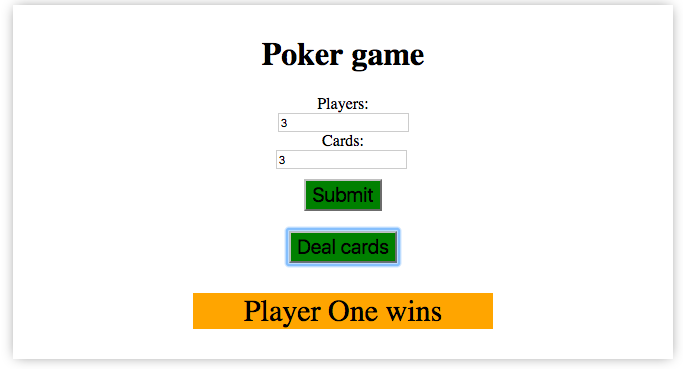
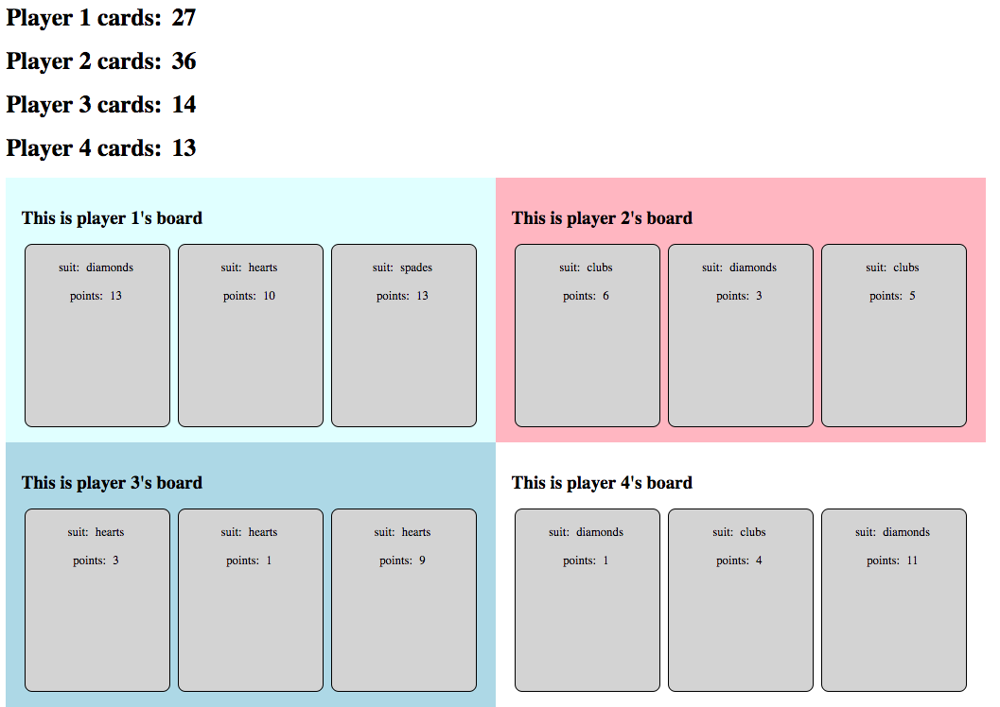

# Poker Game

  

A very simple card game, played between two or more players.  Select how many cards and how many players then click 'deal cards' to find out who wins.

The game shuffles a standard 52 pack of cards and then adds the values of the cards and decides a winner (or draw).  Each hand is scored by summing the face value of each card (from Ace to 10) and then 11 for a Jack, 12 for a Queen and 13 for a King.

Full app can be seen here at https://blooming-atoll-77191.herokuapp.com/

### Installation and deployment instructions

This app uses HTML5, CSS3 and JavaScript.

#### Still to do:

* Change 11, 12 and 13 to Jack, Queen and King
* Put most of the code into loops to make it dynamic.
* Make it look a little less boxy and more attractive, images instead of cards.
* Score Board

  

